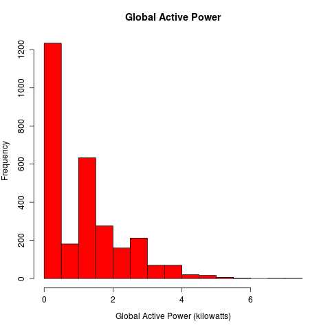
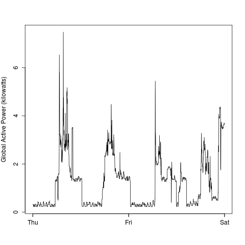
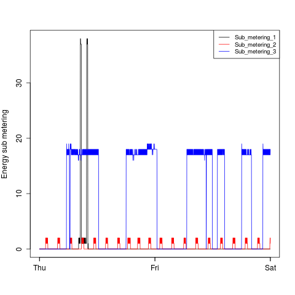

[This is a complete rewrite of the original README in the forked repository.]

## Contents of the repository

* `README.md` -- this file.
* `reproduce.R` -- R script for complete reproduction of the analysis (See 'Workflow' below).
* `plot*.R` -- R scripts for creating each plot (four scripts).
* `plot*.png` -- PNG images of each plot (four images).

## Raw data 

* <b>Dataset</b>: <a href="https://d396qusza40orc.cloudfront.net/exdata%2Fdata%2Fhousehold_power_consumption.zip">Electric power consumption</a> [20Mb]

* <b>Description</b>: Measurements of electric power consumption in
one household with a one-minute sampling rate over a period of almost
4 years. Different electrical quantities and some sub-metering values
are available.

The following descriptions of the 9 variables in the dataset are taken
from
the <a href="https://archive.ics.uci.edu/ml/datasets/Individual+household+electric+power+consumption">UCI
web site</a>:

<ol>
<li><b>Date</b>: Date in format dd/mm/yyyy </li>
<li><b>Time</b>: time in format hh:mm:ss </li>
<li><b>Global_active_power</b>: household global minute-averaged active power (in kilowatt) </li>
<li><b>Global_reactive_power</b>: household global minute-averaged reactive power (in kilowatt) </li>
<li><b>Voltage</b>: minute-averaged voltage (in volt) </li>
<li><b>Global_intensity</b>: household global minute-averaged current intensity (in ampere) </li>
<li><b>Sub_metering_1</b>: energy sub-metering No. 1 (in watt-hour of active energy). It corresponds to the kitchen, containing mainly a dishwasher, an oven and a microwave (hot plates are not electric but gas powered). </li>
<li><b>Sub_metering_2</b>: energy sub-metering No. 2 (in watt-hour of active energy). It corresponds to the laundry room, containing a washing-machine, a tumble-drier, a refrigerator and a light. </li>
<li><b>Sub_metering_3</b>: energy sub-metering No. 3 (in watt-hour of active energy). It corresponds to an electric water-heater and an air-conditioner.</li>
</ol>

## Tidy subset

The tidy subset contains observations from dates 2007-02-01 and 2007-02-02. The variables are the same as in the upstream dataset but appropriately converted. Particularly:

* **Data**: standard R Date class.
* **Time**: standard R DateTime class.
* **Global_active_power**: numeric class
* **Global_reactive_power**: numeric class
* **Voltage**: numeric class
* **Global_intensity**: numeric class
* **Sub_metering_1**: numeric class
* **Sub_metering_2**: numeric class
* **Sub_metering_3**: numeric class

## Workflow

Each `plot*.R` produces a PGN image for a particular graph. To avoid code repetitions each `plot*.R` sources `reproduce.R`, that creates the tidy subset this way:

1. Download the raw dataset archive.
2. Filter (without decompressing to disk) the target observations.
3. Load filtered observations into a data.frame.
4. Tidy up the data.frame by converting appropriately each variable.

The second step is not required, but it saves memory and disk space at once.

[`*`] A better modularization would have been to create a single main script for cleaning, subsetting and creating all plots, so that the code for each plot were sourced by this main script. I refrain from implementing this strategy to stick strictly with the assignment guidelines.

## Plots

The four plots are the following [side by side plots of the provided examples versus the plots generated by these scripts]:

| STAFF'S PLOT                                                  | MY PLOT              |
|:-------------------------------------------------------------:|:--------------------:|
|   |   |
|   |   |
|   |   |
|   |   |

